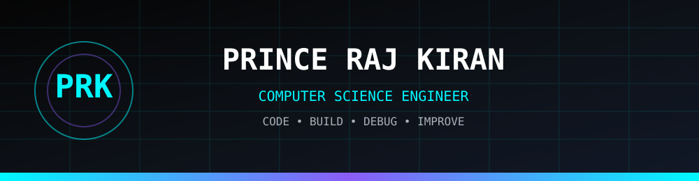

<div align="center">



# `Prince Raj Kiran`

### `Computer Science Engineer • Developer • Builder`

<p>
  <a href="https://github.com/PrinceRajKiranOfficial">
    
  </a>
  
  
  
</p>

</div>

---

## `> whoami`

```cpp
#include <iostream>
#include <vector>

class PrinceRajKiran
{
public:

    std::string name = "Prince Raj Kiran";
    std::string role = "Computer Science Engineer";

    std::vector<std::string> interests = {
        "Software Development",
        "Data Structures & Algorithms",
        "Web Development",
        "Cloud Computing",
        "Cybersecurity",
        "Automation",
        "Artificial Intelligence"
    };

    std::string philosophy =
        "Learn. Build. Break. Fix. Improve.";
};
```

---

## `> about_me`

```text
╭──────────────────────────────────────────────────────────────╮
│                     SYSTEM PROFILE                           │
├──────────────────────────────────────────────────────────────┤
│                                                              │
│  NAME       : Prince Raj Kiran                              │
│  FIELD      : Computer Science Engineering                  │
│  STATUS     : Learning • Building • Experimenting           │
│                                                              │
│  FOCUS                                                        │
│  ├── Software Development                                   │
│  ├── Data Structures & Algorithms                            │
│  ├── Web Development                                         │
│  ├── Cloud Computing                                         │
│  ├── Cybersecurity                                           │
│  ├── Automation                                              │
│  └── Artificial Intelligence                                │
│                                                              │
│  PHILOSOPHY                                                  │
│  └── Turn ideas into working software.                      │
│                                                              │
╰──────────────────────────────────────────────────────────────╯
```

---

# `> tech_stack`

### Languages

<p align="center">


</p>

### Web

<p align="center">


</p>

### Cloud & Tools

<p align="center">


</p>

---

# `> current_mission`

```text
┌──────────────────────────────────────────────────────────────┐
│                         MISSION CONTROL                      │
├──────────────────────────────────────────────────────────────┤
│                                                              │
│  [01]  Master Data Structures & Algorithms        ACTIVE     │
│  [02]  Build Real-World Projects                 ACTIVE     │
│  [03]  Explore AWS & Cloud Computing              ACTIVE     │
│  [04]  Learn Cybersecurity                        ACTIVE     │
│  [05]  Explore Artificial Intelligence            ACTIVE     │
│  [06]  Improve Software Engineering Skills        ACTIVE     │
│                                                              │
└──────────────────────────────────────────────────────────────┘
```

---

# `> featured_projects`

<table>
<tr>

<td width="50%" valign="top">

## `01` 🔐 Cybersecurity

Building security-oriented applications and experimenting with threat detection, monitoring and defensive technologies.

**Focus**

`Security` `Detection` `Python` `Web`

</td>

<td width="50%" valign="top">

## `02` 🌐 Web Applications

Developing practical applications with frontend interfaces, backend services and databases.

**Focus**

`HTML` `CSS` `JavaScript` `Flask` `Java`

</td>

</tr>

<tr>

<td width="50%" valign="top">

## `03` 🤖 Automation

Creating tools that automate repetitive tasks and improve workflows.

**Focus**

`Python` `Automation` `APIs` `Desktop Tools`

</td>

<td width="50%" valign="top">

## `04` ☁️ Cloud

Learning cloud architecture, deployment and infrastructure using AWS.

**Focus**

`AWS` `Cloud` `Deployment` `Infrastructure`

</td>

</tr>
</table>

---

# `> coding_philosophy`

```python
def developer_life():

    while True:

        learn()

        build()

        experiment()

        encounter_error()

        debug()

        understand()

        improve()
```

```text
LEARN
  ↓
BUILD
  ↓
BREAK
  ↓
DEBUG
  ↓
UNDERSTAND
  ↓
IMPROVE
  ↓
REPEAT
```

---

# `> development_environment`

```text
OS              → Windows / Linux
Editor          → VS Code
Languages       → C++ / Java / Python / JavaScript
Version Control → Git / GitHub
Cloud           → AWS
Backend         → Flask / Spring
Database        → MySQL
Terminal        → PowerShell / Linux Shell
```

---

# `> github`

<div align="center">

<a href="https://github.com/PrinceRajKiranOfficial?tab=repositories">


</a>

<br><br>

<a href="https://github.com/PrinceRajKiranOfficial">


</a>

</div>

---

# `> goals`

```text
2026

[██████████████████░░]  Data Structures & Algorithms
[████████████████░░░░]  Java & Spring
[██████████████░░░░░░]  AWS & Cloud
[████████████░░░░░░░░]  Cybersecurity
[███████████░░░░░░░░░]  Artificial Intelligence
[███████████████░░░░░]  Real-World Projects
```

---

# `> connect`

<div align="center">

<a href="https://github.com/PrinceRajKiranOfficial">


</a>

</div>

---

<div align="center">


### `while(alive) { keep_building(); }`

</div>
s
